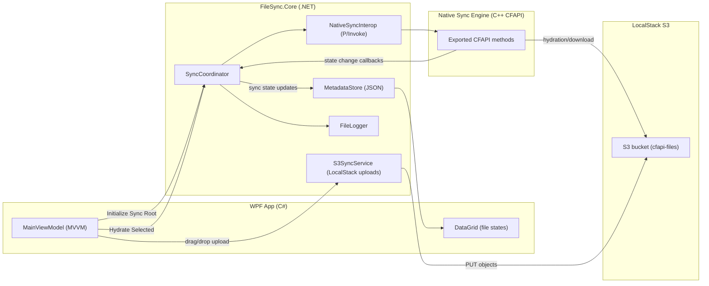

# Assignment Architecture Mapping

## Target Architecture

WPF App (C#) -> Interop (P/Invoke) -> Native Sync Engine (C++ CFAPI) -> LocalStack S3

## Architecture Diagram

## Implemented Components

- `FileSync.App`:
  - WPF UI and MVVM-style `MainViewModel`
  - Drag-and-drop upload
  - Auto-updating DataGrid with file state
- `FileSync.Core`:
  - `NativeSyncInterop`: C# P/Invoke layer
  - `SyncCoordinator`: orchestration logic
  - `S3SyncService`: LocalStack upload service
  - `MetadataStore`: JSON persistence
  - `FileLogger`: app and exception logging
- `FileSync.Interop.Native`:
  - Native exported CFAPI methods:
    - `RegisterSyncRoot`
    - `CreatePlaceholderFile`
    - `TriggerHydration`
    - `NotifyFileStateChange`

## Error Handling Strategy

- Native functions return `HRESULT`.
- C# layer throws `NativeSyncException` for non-zero result.
- UI catches exceptions and surfaces user-friendly status messages.
- All failures are logged to file.
